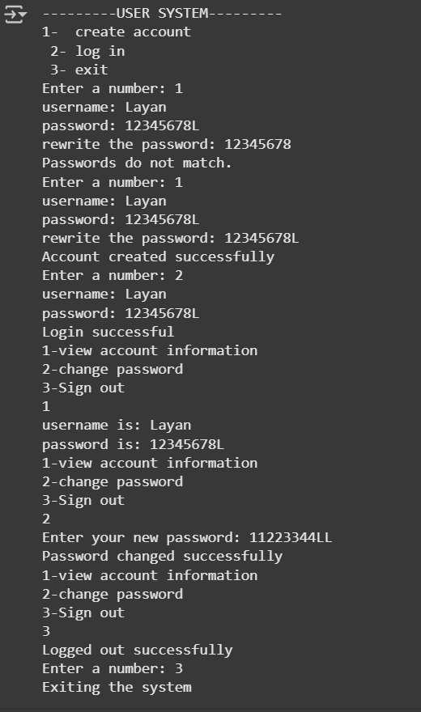

# user-system (Python)
This is a simple Python project that simulates a basic user management system.

##  Features
- Create account with username and strong password
- Password must include at least:
  - 8 characters
  - One digit
  - One letter
- Log in using saved username and password
- View account information after login
- Change password after login

##  How it works
All data is stored in memory (not permanent). This project is for learning purposes and does not use files or databases.

##  Sample output:

